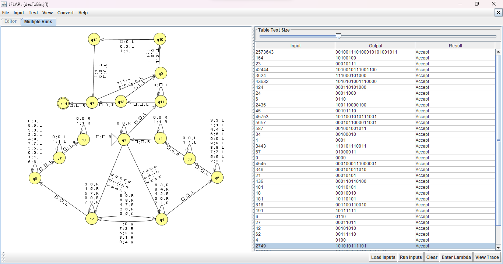

# Máquina de Turing que converte números inteiros positivos no formato decimal para o formato binário

##### Software utilizado: [Jflap](https://www.jflap.org/)

Testes com inputs decimail diversos.
