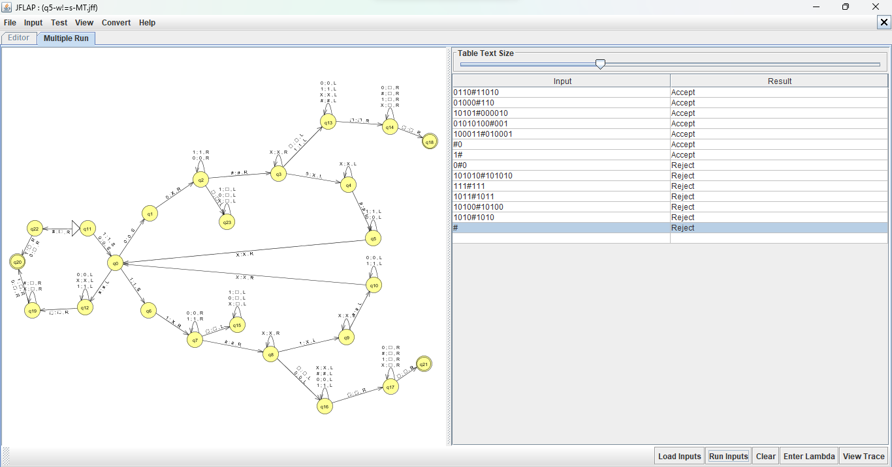

# Máquina de Turing que aceita somente palavras diferentes e no formato "w#s"

## Instruções

1- Construa uma Máquina de Turing que aceite a linguagem  L = {w#s | w, s ∈ {0,1}* e w ≠ s}.

##### A máquina deve aceitar somente palavras binárioa diferentes.

##### Software utilizado: [Jflap](https://www.jflap.org/)

