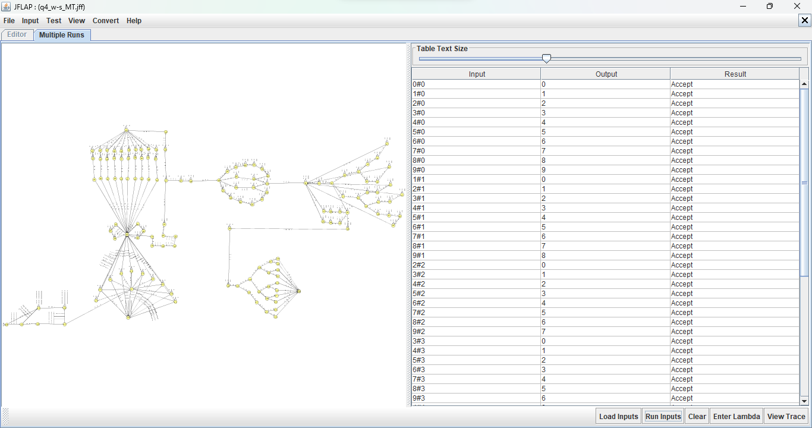
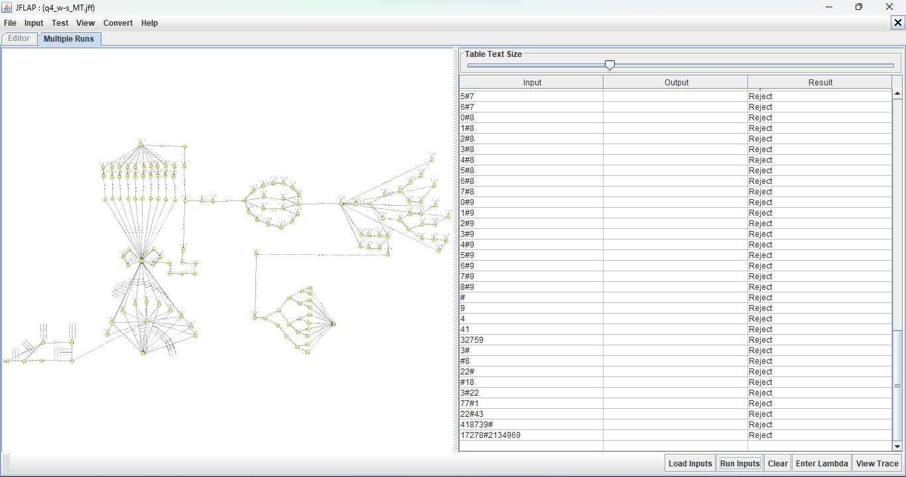

# Máquina de Turing realiza subtração de numeros entre 0 e 9 no formato "w#s"

## Instruções

1. Construa uma Máquina de Turing composta para efetuar a operação “subtração” entre dois números naturais escritos separados por #. Se o parâmetro da esquerda é maior que o da direita o resultado é a subtração, senão o resultado é zero, isto é, a fita será apagada. Você pode considerar números de 0 até 9.

##### A máquina deve realizar a subtração de números naturais entre 0 e 9.

##### Software utilizado: [Jflap](https://www.jflap.org/)

Teste aceitando inputs e fazendo o cálculo de subtração.

Teste recusando inpusts e fita apagada.
